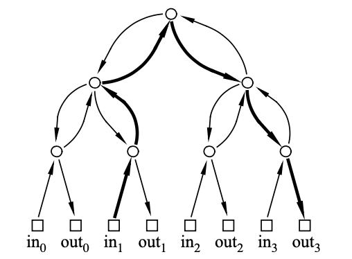
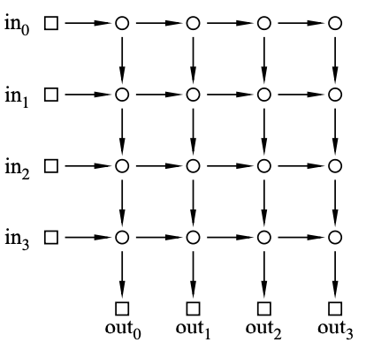
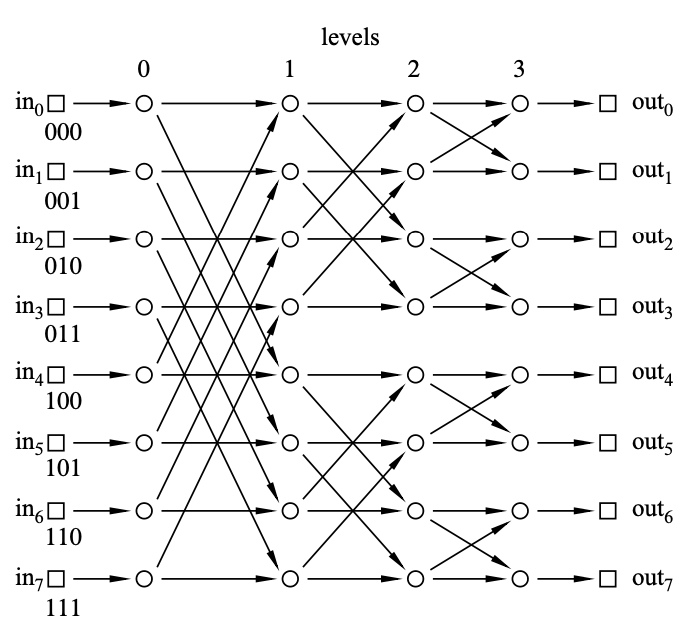
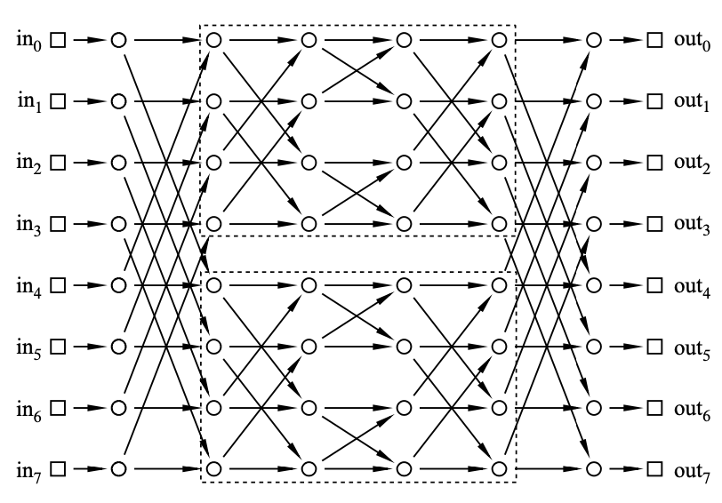

# <u>***U2. Structures***</u>

# L6. Graph theory and coloring

## Graph Theory

Informally, a graph is a bunch of dots and lines where the lines connect some pairs of dots 

**Definition 5.1.1.** A simple graph $G$ consists of a nonempty set $V$, called the vertices (aka nodes) of $G$, and a set $E$ of two-element subsets of $V$. The members of $E$ are called the edges of $G$, and we write $G=(V, E)$.

Def: Two nodes $x_{i}, x_{j}$ are <u>*adjacent*</u> if $\left\{x_{i}, x_{j}\right\} \in E$
Def: An edge $e:\left\{x_{i}, x_{j}\right\}$ is <u>*incident*</u> to $x_{i}, x_{j}$
Def: The number of edges incident to a node is the <u>*degree*</u> of the node
Def: A graph is <u>*simple*</u> if it has no loops or multiple edges

## Graph Coloring Problem

**Definition:** Given a graph $G$ and $K$ colors, assign a color to each node s.t. adjacent nodes get different colors

### Chromatic Number

**Definition 5.3.1.** The minimum value of $k$ for which a graph $G$ has a valid $k$ coloring is called its chromatic number, $\chi(G)$.

NP-Complete Problem

### Basic Coloring Algorithm for $G=(V,E)$

1. Order the nodes $V_{1}, V_{2}, \ldots, V_{n}$
2. Order the colors $C_{1}, C_{2}, \ldots$
3. For $i=1,2, \ldots, n$, Assign the lowest legal color to $V_{i}$

(a greedy algorithm)

**Theorem 5.3.2.** A graph with maximum degree at most $k$ is $(k+1)$ -colorable.

Proof by Induction

## Bipartite Graph

**Definition:** A graph $G=(V, E)$ is bipartite if $V$ can be split into $V_L$, $V_R$ s.t. all the edges connect a node in the $V_L$ to a node in $V_R$

# *Thinking*

1. 图论的起源是柯尼斯堡七桥问题，在欧拉（又是欧拉）试图证明没有符合条件的走法的过程中抽象出了图论的两个最基本元素：点和线。从实际问题抽象出理论，对于抽象理论的发展再反哺未来出现的实际问题。

2. 这一讲首先定义了图，然后展开讨论了染色问题，其主要应用在于处理计划冲突，如期末考试和服务器升级

# L7. Matching Problems

**Definition:** Given graph $G=(V, E)$, a matching is a subgraph of $G$ where every node has degree 1

Def: A matching $M$ is <u>*perfect*</u> if it has size $\frac{|V|}{2}$
Def: The <u>*weight*</u> of a matching $M$ is the sum of the weights on the edges of $M$
Def: A <u>*min-weight matching*</u> for $G$ is a prefect matching for $G$ with the minimum weight
Def: Given a matching $M, x, y$ forming a <u>*rogue couple*</u> if they prefer each other to their mates in $M$
Def: A matching $M$ is <u>*stable*</u> if there aren't any rogue couples

## Stable Marriage Problem

Def: 

1. N boys & N girls
2. each boy has his own ranked list of all the girls and vice versa
3. Goal: Find a perfect matching that is stable

### The Mating Algorithm ( TMA )

The procedure for finding a stable matching involves a Mating Ritual that takes place over several days. The following events happen each day: 

**Morning:** Each woman stands on her balcony. Each man stands under the balcony of his favorite among the women on his list, and he serenades her. If a man has no women left on his list, he stays home and does his math homework. 

**Afternoon:** Each woman who has one or more suitors serenading her, says to her favorite among them, “We might get engaged. Come back tomorrow.” To the other suitors, she says, “No. I will never marry you! Take a hike!” 

**Evening:** Any man who is told by a woman to take a hike, crosses that woman off his list. 

**Termination condition:** When a day arrives in which every woman has at most one suitor, the ritual ends with each woman marrying her suitor, if she has one.

### Results

**Theorem I.** TMA terminates in $\leq N^{2}+1$ days
Proof by contradiction: $N^{2}+1$ girls have been crossed off in boys' lists

**Theorem II.** Everyone gets married and stable
Lemma (Invariant). If a girl $G$ ever rejected a boy $B$, then $G$ has a suitor who she prefers to $B$
Proof by contradiction: $B$ is rejected by every girl

**Theorem III.** No rogue couples
Case l: the girl rejected the boy
Case Il: the boy didn't serenade the girl

-Def: Let $S=$ set of all stable matchings, $S \neq \phi$
-Def: for each person $P$, we define <u>*the realm of possibility*</u> for $P$ to be $\{Q \mid \exists M \in S,\{P, Q\} \in M\}$
-Def: A person's <u>*optimal mate*</u> is his/her favorite from the realm of possibility
-Def: A person's <u>*pessimal mate*</u> is his/her least favorite from the realm of possibility

**Theorem IV.** TMA marries every boy with his optimal mate

**Theorem V.** TMA marries every girl with her pessimal mate

## *Thinking*

1. 这一讲用图定义了匹配问题，但解决算法中似乎没有用到图。这里图似乎主要是一种描述及论述问题的符号系统。
2. TMA算法的第四五定理似乎表明了一种现实世界的理论，即主动追求比被动等待会有更好的结果。（面对复杂的世界，数理逻辑或许是一种确立信念的方式）

# L8. Graph Theory II: Minimum Spanning Trees

## Walks and Paths

**Definition 5.4.1.** A walk in a graph, $G$, is a sequence of vertices
$$
v_{0}, v_{1}, \ldots, v_{k}
$$
and edges
$$
\left\{v_{0}, v_{1}\right\},\left\{v_{1}, v_{2}\right\}, \ldots,\left\{v_{k-1}, v_{k}\right\}
$$
such that $\left\{v_{i}, v_{i+1}\right\}$ is an edge of $G$ for all $i$ where $0 \leq i<k$.

**Definition:** A path is a walk where all the $v_{i}$ 's are different, that is
$$
i\neq j \implies v_i\neq v_j
$$
**Lemma 5.4.2.** If there is a walk from a vertex $u$ to a vertex $v$ in a graph, then there is a path from $u$ to $v .$

## Connectivity

**Definition 5.5.1.** Two vertices in a graph are said to be connected if there is a path that begins at one and ends at the other. By convention, every vertex is considered to be connected to itself by a path of length zero.

**Definition 5.5.2.** A graph is said to be connected when every pair of vertices are connected.

## Cycles and Closed Walks

**Definition:** A closed walk in a walk that starts and ends at the same vertex

**Definition:** If $k \geq 3$ and $v_{0}, v_{1}, \ldots, v_{k-1}$ are all different, then it is called a cycle

## Trees

**Definition 5.7.1.** A connected acyclic graph is called a <u>*tree*</u>

**Definition 5.7.2.** If every connected component of a graph $G$ is a tree, then $G$ is a <u>*forest*</u>.

**Definition 5.7.3.** A leaf is a node with degree 1 in a tree (or forest)

**Theorem 5.7.4.** Every tree has the following properties:

1. Any connected subgraph is a tree.
2. There is a unique simple path between every pair of vertices.
3. Adding an edge between nonadjacent nodes in a tree creates a graph with a cycle.
4. Removing any edge disconnects the graph.
5. If the tree has at least two vertices, then it has at least two leaves.
6. The number of vertices in a tree is one larger than the number of edges.

## Spanning Tree

**Definition:** A <u>*spanning tree (ST)*</u> of a connected graph is a subgraph that is a tree with the same vertices as the graph.

**Theorem 5.7.5.** Every connected graph contains a spanning tree.

## Minimum-Weight Spanning Trees (MST)

**Definition 5.7.6.** The min-weight spanning tree (MST) of an edge-weighted graph $G$ is the spanning tree of $G$ with the smallest possible sum of edge weights.

**Algorithm 1.** Grow a tree one edge at a time by adding the minimum weight edge possible to the tree, making sure that you have a tree at each step.

**Algorithm 2.** Grow a subgraph one edge at a time by adding the minimum-weight edge possible to the subgraph, making sure that you have an acyclic subgraph at each step.

**Theorem 5.7.7.** For any connected, weighted graph $G$, Algorithm 2 produces an MST for $G$

**Lemma 5.7.8.** For any $m \geq 0$, let $S$ consist of the first $m$ edges selected by Algorithm 2. Then there exists some MST $T=(V, E)$ for $G$ such that $S \subseteq E$, that is, the set of edges that we are growing is always contained in some MST.

<u>*Proof (p.169)*</u>

## *Thinking*

这一讲换了一个博士生Dr. Marten van Dijk来讲，基本是在陈述定理和推导过程，让人不太打得起精神，不像Prof. Tom Leighton那样将理论置于故事的文脉中。

# L9. Communication networks

$\begin{array}{lllll}\text { Network } & \text { Diameter } & \text { Switch size } & \text { \# switches } & \text { Congestion } \\ \text { complete binary tree } & 2 \log N+2 & 3 \times 3 & 2 N-1 & N \\ \text { 2D array } & 2 N & 2 \times 2 & N^{2} & 2 \\ \text { butterfly } & \log N+2 & 2 \times 2 & N(\log N+1) & \sqrt{N} \text { or } \sqrt{N / 2} \\ \text { Benes } & 2 \log N+1 & 2 \times 2 & 2 N \log N & 1\end{array}$

Def: <u>*Latency*</u> is the time required for a packet to travel form an input to an output

Def: <u>*Diameter*</u> of a network is going to be the length of the shortest path between the input and the output that are furthest apart

<u>*Switch Size*</u>: One way to reduce the diameter of a network (and hence the latency needed to route packets) is to use larger switches. 

<u>*Switch Count*</u>: using 3x3 switches, binary tree, 2N-1 switches

Def: A <u>*Permutation*</u> is a function $\pi:\{0,1, n-1\} \rightarrow\{0,1, n-1\}$ such that no two numbers
are mapped to the same value
$$
\pi(i)=\pi(j) \Longleftrightarrow i=j
$$
Def: <u>*Permutation Routing Problem*</u> for $\pi$ : For each $i$ direct the packet at $\operatorname{In}_{i}$ to $O u t_{\pi(i)}:$ path
taken is denoted by $P_{i . \pi(i)}$

Def: The <u>*congestion*</u> is equal to the largest number of paths that pass through a single switch

## The Complete Binary Tree

figure. A 4-input, 4-output complete binary tree. The squares represent terminals (input and output registers) and the circles represent switches. 

## The 2-d Array

figure. A 4x4 2-dimensional array.

## The Butterfly

figure. An 8-input/output butterfly.

## Benes network

figure. A 2N -input Beneš network contains two N-input Beneš networks — shown here for N = 4.

## *Thinking*

Dr. Marten van Dijk的讲座，等到需要用到的时候再根据Prof. Albert R. Meyer的课程来复习。

# L10. Graph theory III

## Euler Tours

**Definition:** An Euler tour is a walk that traverses every edge exactly once and starts and finishes at the same vertex

**Theorem 5.6.3.** A connected graph has an Euler tour if and only if every vertex has even degree.

## Directed Graphs

**Definition 6.1.1.** A directed graph $G=(V, E)$ consists of a nonempty set of nodes $V$ and a set of directed edges $E .$ Each edge $e$ of $E$ is specified by an ordered pair of vertices $u, v \in V .$ A directed graph is simple if it has no loops (that is, edges of the form $u \rightarrow u$ ) and no multiple edges.

**Definition 6.1.3.** A directed graph $G=(V, E)$ is said to be strongly connected if for every pair of nodes $u, v \in V$, there is a directed path from $u$ to $v$ (and vice-versa) in $G$.

**Definition.** A directed graph is called a directed acyclic graph ( DAG ), if it does not contain any directed cycles

## Tournament Graphs

Def: Suppose that $n$ players compete in a round-robin tournament and that for every pair of players $u$ and $v$, either $u$ beats $v$ or $v$ beats $u .$ Interpreting the results of a roundrobin tournament can be problematic- there might be all sorts of cycles where $x$ beats $y$ and $y$ beats $z$, yet $z$ beats $x .$ Who is the best player? Graph theory does not solve this problem but it can provide some interesting perspectives.

### Hamiltonian Path

**Definition.** A directed Hamiltonian path is a directed walk that visits every vertex exactly once

**Theorem 6.2.1.** Every tournament graph contains a directed Hamiltonian path.

### The King Chicken Theorem

**Theorem 6.2.2 (King Chicken Theorem).** The chicken with the largest outdegree in an $n$ -chicken tournament is a king.

## *Thinking*

Dr. Marten van Dijk的讲座

# L11. Relations, partial orders, and scheduling

## Binary Relations

**Definition 7.1.1.** Given sets $A$ and $B$, a binary relation $R: A \rightarrow B$ from $A$ to $B$ is a subset of $A \times B .$ The sets $A$ and $B$ are called the domain and codomain of $R$, respectively. We commonly use the notation $a R b$ or $a \sim_{R} b$ to denote that $(a, b) \in R$

## Relations on One Set

**Definition.** A relation on $\mathrm{A}$ is a subset $R \subseteq A \times A$

e.g. Let $A=\mathbb{Z}$ and let $x R y$ hold if and only if $x \equiv y(\bmod 5)$.

### Representation as a Digraph

Set $A$ together with $R$ is a directed graph: $G=(V, E)$, with $V=A, E=R$

### Properties

Reflexivity: $x R x$ for all $x \in A$
Symmetry: if $x R y \Rightarrow y R x$ for all $x, y \in A$
Antisymmetry: if $x R y \wedge y R x \Rightarrow x=y$
Transitivity: if $x R y \wedge y R z \Rightarrow x R z$

**Definition.** A relation is an *equivalence relation* if it is reflexive, symmetric, and transitive.

**Definition 7.4.1.** Given an equivalence relation $R: A \rightarrow A$, the *equivalence class* of an element $x \in A$ is the set of all elements of $A$ related to $x$ by $R .$ The equivalence class of $x$ is denoted $[x] .$ Thus, in symbols:
$$
[x]=\{y \mid x R y\}
$$
**Definition 7.4.2.** A partition of a finite set $A$ is a collection of disjoint, nonempty subsets $A_{1}, A_{2}, \ldots, A_{n}$ whose union is all of $A$. The subsets are usually called the blocks of the partition. For example, one possible partition of $A=\{a, b, c, d, e\}$ is
$$
A_{1}=\{a, c\} \quad A_{2}=\{b, e\} \quad A_{3}=\{d\}
$$
**Theorem 7.4.3.** The equivalence classes of an equivalence relation on a set $A$ form a partition of $A$.

## Partial Orders

**Definition 7.5.1.** A relation $R$ on a set $A$ is a *weak partial order* if it is transitive, antisymmetric, and reflexive. The relation is said to be a *strong partial order* if it is transitive, antisymmetric, and irreflexive.

A partial order relation is denoted with $\preceq$ or $\sqsubseteq$ instead of $R$

**Definition 7.6.1.** Given a partial order $\preceq$ on a set $A$, the pair $(A, \preceq)$ is called a partially ordered set or poset.

**Theorem 7.6.2.** A poset has no directed cycles other than self-loops.

### Hasse Diagram

**Definition.** a Hasse diagram for a poset $(A, \preceq)$ is a digraph with vertex $\operatorname{set} A$ and edge set $\preceq$ minus all self-loops and edges implied by transitivity

### Total Order

**Definition.** $a$ and $b$ is comparable if $a \preceq b$ or $b \leq a$

**Definition 7.5.2.** A total order is a partial order in which every pair of distinct elements is comparable.

### Topological Sort

**Definition 7.7.1.** A topological sort of a poset $(A, \preceq)$ is a total order $\left(A, \preceq_{T}\right)$ such that
$$
x \preceq y \text { IMPLIES } x \preceq _T y
$$
**Theorem 7.7.2.** Every finite poset has a topological sort.

**Lemma 7.7.3.** Every finite poset has a minimal element.

## *Thinking*

Dr. Marten van Dijk的讲座