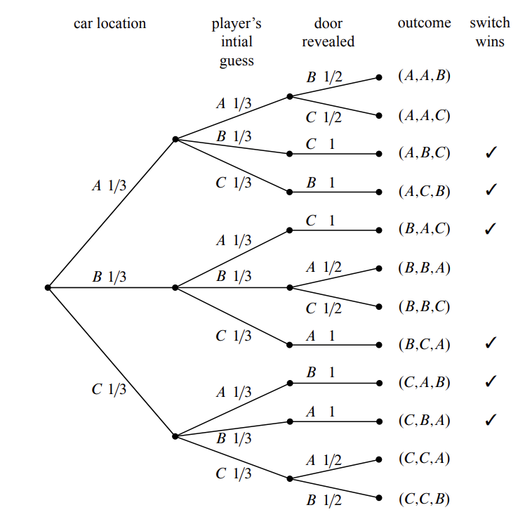

# **<u>*U4. Probability*</u>**

# L18. Probability Introduction

Definition. the *sample space* for an experiment is simply the set of all possible outcomes

Definition. an *outcome (sample point)* consists of all the information about the experiment after it has performed, including the values of all choices

Definition. a *probability space* consists of a sample space and a *probability function* $\mathrm{Pr}: S\to \mathbb{R}$, suth that

1. $\forall \omega \in S, \quad 0 \leqslant P(\omega) \leqslant 1$
2. $\sum_{\omega \in S} \operatorname{Pr}(\omega)=1$

Definition. An *event* is a subset of the sample space

## The Four Step Method

### Step I: Find the Sample Space

Definition. an outcome of the Monty Hall Game when the contestant switches consists of

1. box w/ prize
2. box chosen first
3. box revealed

e.g. sample point $(A, B, C)$ is where

1. The prize is in box $B$
2. The player picks first box $A$
3. Carol reveals box $C$

Constructing the Sample Space-The Tree Method

### Step II: Define Events of Interest

### Step III: Determine Outcome Probabilities

Assumptions

1. The prize is in each box w/ prob 1/3
2. No matter what the prize is, player picks each box w/ prob 1/3
3. No matter where the prize is, if Carol has choice, she picks each box with prob 1/2

#### III-1: Assign Edge Probabilities

#### III-2: Compute Outcome Probabilities

### Step IV: Compute Event Probabilities

Definition. The probability that an event ESS occurs is $\sum_{\omega \in E} \operatorname{Pr}(\omega)$

Definition. A sample space $S$ is *uniform* if every sample $p t$ has the same $\operatorname{Pr}(\omega)=\frac{1}{|S|}$

## *Thinking*

这一讲开始讨论概率论，现实生活中人们在概率方面的直觉经常是错误的（例如本讲的Monty Hall Game）。然而只需要根据极为简单的方法（即这一讲主要讨论的四步法），我们便可以避免这些错误。

# L19. Conditional Probability

**Definition 15.1.1.**
$$
\operatorname{Pr}[A \mid B]::=\frac{\operatorname{Pr}[A \cap B]}{\operatorname{Pr}[B]}
$$
If $\operatorname{Pr}[B]=0$, then the conditional probability $\operatorname{Pr}[A \mid B]$ is undefined.

**Rule (Product Rule for 2 Events).** If $\operatorname{Pr}\left[E_{1}\right] \neq 0$, then:
$$
\operatorname{Pr}\left[E_{1} \cap E_{2}\right]=\operatorname{Pr}\left[E_{1}\right] \cdot \operatorname{Pr}\left[E_{2} \mid E_{1}\right]
$$
**Rule (Product Rule for $n$ Events).**
$$
\begin{array}{r}
\operatorname{Pr}\left[E_{1} \cap E_{2} \cap \ldots \cap E_{n}\right]=\operatorname{Pr}\left[E_{1}\right] \cdot \operatorname{Pr}\left[E_{2} \mid E_{1}\right] \cdot \operatorname{Pr}\left[E_{3} \mid E_{1} \cap E_{2}\right] \cdots \\
\cdot \operatorname{Pr}\left[E_{n} \mid E_{1} \cap E_{2} \cap \ldots \cap E_{n-1}\right]
\end{array}
$$
provided that
$$
\operatorname{Pr}\left[E_{1} \cap E_{2} \cap \cdots \cap E_{n-1}\right] \neq 0
$$
e.g. In a best 2 out of 3 series, the prob of winning 1st game is 1/2. The prob of winning a game following a win is 2/3. The prob of winning after a loss is 1/3.

### The Four Step Method

## A Posteriori Probabilities

$\operatorname{Pr}[B \mid A]$ where $B$ precedes $A$ in time

e.g. Suppose we have 2 coins

​		Fair coin: head and tail on two sides

​		Unfair coin: heads on both sides

**e.g. Medical Testing**

​		10% population has disease

​		If you have disease, 10% chance test is negative (false negative)

​		If you don’t have disease, 30% chance test is positive (false positive)

​		**Remark: The possibility of disease is low**

e.g. Carnival Dice

​		Player picks a number $N \in[1,6] \&$ rolls three dice ( fair )

​		Player winds iff $N$ matches $\leq 1$ dice
$$
\begin{aligned}
\operatorname{Pr}\left(A_{1} \cup A_{2} \cup A_{3}\right)=& \operatorname{Pr}\left(A_{1}\right)+\operatorname{Pr}\left(A_{2}\right)+\operatorname{Pr}\left(A_{3}\right) \\
&-\operatorname{Pr}\left(A_{1} \cap A_{2}\right)-\operatorname{Pr}\left(A_{2} \cap A_{3}\right)-\operatorname{Pr}\left(A_{2} \cap A_{3}\right) \\
&+\operatorname{Pr}\left(A_{1} \cap A_{2} \cap A_{3}\right)
\end{aligned}
$$
​		**Conditioning on a Single Event:**
$$
\operatorname{Pr}[A \cup B \mid C]=\operatorname{Pr}[A \mid C]+\operatorname{Pr}[B \mid C]-\operatorname{Pr}[A \cap B \mid C]
$$
​		**-False Claim**: $\operatorname{Pr}[A \mid B \cup C]=\operatorname{Pr}[A \mid B]+\operatorname{Pr}[A \mid C]-\operatorname{Pr}[A \mid B \cap C]$
​				**e.g. Discrimination Lawsuit ( p.428)**

# L20. Independence

## Independence

**Definition**: Events $A$ and $B$ are independent if $\operatorname{Pr}[B]=0$ or if
$$
\operatorname{Pr}[A \mid B]=\operatorname{Pr}[A]
$$
Disjoint events are never independent, $A \cap B=\varnothing$

**Product Rule for Independent Events**

​		$A$ and $B$ are independent if and only if
$$
\operatorname{Pr}[A \cap B]=\operatorname{Pr}[A] \cdot \operatorname{Pr}[B]
$$
**Symmetry of Independence**			

​		If $A$ is independent of $B$, then $B$ is independent of $A$

e.g. 2 fair independent coins

​		$A=$ event coins match

​		$B=$ event 1st coin is $\mathrm{H}$

​		$A$ and $B$ are independent

### Independence Is an Assumption

e.g. OJ: Blood matching

### Mutual Independence

**Definition**: A set of events $E_{1}, E_{2}, \ldots, E_{n}$, is mutually independent if $\forall i \in[1, n]$ and $\forall S \subseteq[1, n]-\{i\}$, either
$$
\operatorname{Pr}\left[\bigcap_{j \in S} E_{j}\right]=0 \quad \text { or } \quad \operatorname{Pr}\left[E_{i}\right]=\operatorname{Pr}\left[E_{i} \mid \bigcap_{j \in S} E_{j}\right]
$$
**Alternative Formulation (Product)**

​		A set of events $E_{1}, E_{2}, \ldots, E_{n}$, is mutually independent iff $\forall S \subseteq[1, n]$
$$
\operatorname{Pr}\left[\bigcap_{j \in S} E_{j}\right]=\prod_{j \in S} \operatorname{Pr}\left[E_{j}\right]
$$
e.g. Flip 3 fair mutually independent coins

​		$A=$ event coin 1 matches coin 2

​		$B=$ event coin 2 matches coin 3

​		$C=$ event coin 3 matches coin 1

​		Not mutually independent

### Pairwise independent

**Definition**: Events $E_{1}, E_{2}, \ldots, E_{n}$ are pairwise independent iff $\forall i, j \in[1, n](i \neq j)$, $E_{i} \& E_{j}$ are independent

### OJ

$$
\begin{aligned}
&\operatorname{Pr}[\text { Killing } \mid \text { Batter }]=1 / 2000 \\
&\operatorname{Pr}[\text { Killing } \mid \text { Batter } \cap \text { Murdered }]>1 / 2
\end{aligned}
$$

### Birthday Problem

$N$ birthdays ( e.g. $N=365$ )

$M$ people (e.g. $M=100$ )

Q: What is the probability that some birthday is shared by two people?

### Def: $x$ collides with $y$ if $h(x)=h(y)$ but $x \neq y$

### Birthday Principle

$$
N \sim \frac{m^{2}}{2 \ln (2)}
$$

# L21. Random Variables

## **Definitions**

Def: A **random variable** $R$ is a function $R: S \rightarrow \mathbb{R}$, where $S$ : sample space

Def: An **indicator (Bernoulli / Characteristic ) random variable** with range $=\{0,1\}$ $\{\omega \mid R(\omega)=X\}$ is the event that $R=x .$

Def: $P_{r}(R=X)=\sum^{\omega \mid R(\omega)=X} \operatorname{Pr}(\omega)$

### Independence

**Definition**: Two random variables $R_{1}, R_{2}$ are independent if
$$
\forall x_{1}, x_{2} \in \mathbb{R} \quad \operatorname{Pr}\left(R_{1}=x_{1} \mid R_{2}=x_{2}\right)=\operatorname{Pr}\left(R_{1}=x_{1}\right) \text { or } \operatorname{Pr}\left(R_{2}=x_{2}\right)=0
$$
​		**Alternative Formulation (Product)**
$$
\begin{aligned}
&\forall x_{1}, x_{2} \in \mathbb{R} \\
&\operatorname{Pr}\left[R_{1}=x_{1} \cap R_{2}=x_{2}\right]=\operatorname{Pr}\left[R_{1}=x_{1}\right] \cdot \operatorname{Pr}\left[R_{2}=x_{2}\right]
\end{aligned}
$$
### e.g. 2 fair independent 6-sided $D_{1}, D_{2}$

Let $S=D_{1}+D_{2}$

Let $T=\left\{\begin{array}{l}1 \text { if } S=7 \\ 0 \text { otherwise }\end{array}\right.$

### Mutual Independence

Definition: Random variables $R_{1}, R_{2}, \ldots, R_{n}$ are mutually independent

iff $\forall x_{1}, x_{2}, \ldots, x_{n} \in \mathbb{R}$
$$
\begin{aligned}
&\operatorname{Pr}\left[R_{1}=x_{1} \cap R_{2}=x_{2} \cap \cdots \cap R_{n}=x_{n}\right] \\
&=\operatorname{Pr}\left[R_{1}=x_{1}\right] \cdot \operatorname{Pr}\left[R_{2}=x_{2}\right] \cdots \operatorname{Pr}\left[R_{n}=x_{n}\right]
\end{aligned}
$$
## **Distribution Functions**

Given r.v. $R$, the **probability (or point) distribution (or density ) function (pdf)** for $R$ is
$$
f(x)=\operatorname{Pr}(R=x)
$$
Def: The **cumulative distribution function** for $R$ is
$$
F(x)=\operatorname{Pr}(R \leq x)=\sum^{y \leq x} \operatorname{Pr}(R=y)
$$
### Bernoulli Distributions

For an indicator r.v.
$$
\begin{aligned}
&f(0)=p, f(1)=1-p \\
&F(0)=p, F(1)=1
\end{aligned}
$$
### Uniform Distributions

For a uniform r.v. on $[1, n]$
$$
f_{n}(k)=\frac{1}{n} \text { for } 1 \leq k \leq n
$$

$$
F_{n}(k)=\frac{k}{n}
$$
### Binomial Distributions

**Unbiased Binomial Distribution**
$$
\begin{aligned}
&f_{n}(k)=\left(\begin{array}{l}
n \\
k
\end{array}\right) 2^{-n} \quad \text { where } n \in \mathbb{N}^{+} \text {and } 0 \leq k \leq n \\
&F_{n}(x)=\sum_{i=0}^{k}\left(\begin{array}{c}
n \\
i
\end{array}\right) 2^{-n} \quad \text { if } k \leq x<k+1 \text { for } 1 \leq k<n
\end{aligned}
$$
**General Binomial Distribution**
$$
\begin{aligned}
&f_{n, p}(k)=\left(\begin{array}{l}
n \\
k
\end{array}\right) p^{k}(1-p)^{n-k} \quad \text { where } n \in \mathbb{N}^{+} \text {and } p \in[0,1] \text { and } 0 \leq \\
&F_{n, p}(x)=\sum_{i=0}^{k}\left(\begin{array}{c}
n \\
i
\end{array}\right) p^{i}(1-p)^{n-i} \quad \text { if } k \leq x<k+1 \text { for } 1 \leq k<n
\end{aligned}
$$
**Approximating the Probability Density Function**
$$
\begin{aligned}
f_{n, p}(\alpha n) &<\frac{2^{n H(\alpha)} p^{\alpha n}(1-p)^{(1-\alpha) n}}{\sqrt{2 \pi \alpha(1-\alpha) n}} \\
&=\frac{2^{n\left(\alpha \log \left(\frac{p}{\alpha}\right)+(1-\alpha) \log \left(\frac{1-p}{1-\alpha}\right)\right)}}{\sqrt{2 \pi \alpha(1-\alpha) n}}
\end{aligned}
$$
**Approximating the Cumulative Distribution Function**
for $\alpha<p$
$$
\begin{aligned}
F_{n, p}(\alpha n) &<f_{n, p}(\alpha n) \sum_{i=0}^{\infty}\left[\frac{\alpha(1-p)}{(1-\alpha) p}\right] \\
&=\frac{f_{n, p}(\alpha n)}{1-\frac{\alpha(1-p)}{(1-\alpha) p}} \\
&=\left(\frac{1-\alpha}{1-\alpha / p}\right) f_{n, p}(\alpha n)
\end{aligned}
$$

# L22. Expecation I

## Expectation

**Definition 18.1.1.** If $R$ is a random variable defined on a sample space $\mathcal{S}$, then the expectation of $R$ is
$$
\operatorname{Ex}[R]::=\sum_{w \in \mathcal{S}} R(w) \operatorname{Pr}[w]
$$
(aka. <u>Expected Value</u> or <u>Average</u> or <u>Mean</u>)

**Theorem 18.1.4 (Alternate Definition).** If $R$ is a random variable defined on a sample space $\mathcal{S}$ then
$$
\operatorname{Ex}[R]=\sum_{x \in \operatorname{range}(R)} x \cdot \operatorname{Pr}[R=x]
$$
**Corollary 18.1.5.** If the range of a random variable $R$ is $\mathbb{N}$, then
$$
\operatorname{Ex}[R]=\sum_{i=1}^{\infty} i \operatorname{Pr}[R=i]=\sum_{i=0}^{\infty} \operatorname{Pr}[R>i] .
$$
<u>*e.g. Gample with 3p*</u>

++2p w/ different choices all the time

<u>*e.g. Mean Time to Failure*</u>

$\operatorname{Ex}[C]=\sum_{i=0}^{\infty} \operatorname{Pr}[C>i]$

$\begin{aligned}
\operatorname{Ex}[C] &=\sum_{i=0}^{\infty}(1-p)^{i} \\
&=\frac{1}{1-(1-p)} \\
&=\frac{1}{p}
\end{aligned}$

<u>*Pitfall: Computing Expectations by Sampling*</u>

e.g. $\mathrm{Pr}(D>i)=1/i$

**Definition 18.1.2 (Median).** The median of a random variable $R$ is the value $x \in \operatorname{range}(R)$ such that
$$
\begin{array}{l}
\operatorname{Pr}[R \leq x] \leq \frac{1}{2} \quad \text { and } \\
\operatorname{Pr}[R>x]<\frac{1}{2}
\end{array}
$$

## Expectations of Sums

### Linearity of Expectation

**Theorem 18.3.1.** For any random variables $R_{1}$ and $R_{2}$,
$$
\operatorname{Ex}\left[R_{1}+R_{2}\right]=\operatorname{Ex}\left[R_{1}\right]+\operatorname{Ex}\left[R_{2}\right]
$$
<u>*e.g. Hat-check Prob*</u>

$\begin{aligned}
\operatorname{Ex}[G] &=\operatorname{Ex}\left[G_{1}+G_{2}+\cdots+G_{n}\right] \\
&=\operatorname{Ex}\left[G_{1}\right]+\operatorname{Ex}\left[G_{2}\right]+\cdots+\operatorname{Ex}\left[G_{n}\right] \\
&=\overbrace{\frac{1}{n}+\frac{1}{n}+\cdots+\frac{1}{n}}^{n} \\
&=1 
\end{aligned}$

**Theorem 18.3.4.** Given any collection of $n$ events $A_{1}, A_{2}, \ldots, A_{n} \subseteq \mathcal{S}$, the expected number of events that will occur is
$$
\sum_{i=1}^{n} \operatorname{Pr}\left[A_{i}\right]
$$
**Theorem.** $\operatorname{Pr}(T \geq 1) \leq \mathrm{Ex}(T)$

**Corollary.** $\operatorname{Pr}(T \geq 1) \leq \sum_{i=1}^{n} \operatorname{Pr}\left(A_{i}\right)$

# L23. Expectation II

**Theorem 19.5.1 (Murphy's Law).** Let $A_{1}, A_{2}, \ldots, A_{n}$ be mutually independent events. Let $T_{i}$ be the indicator random variable for $A_{i}$ and define
$$
T::=T_{1}+T+2+\cdots+T_{n}
$$
to be the number of events that occur. Then
$$
\operatorname{Pr}[T=0] \leq e^{-\operatorname{Ex}[T]}
$$
<u>*++if a billion impossible things with one in a million possibility, then something must happen.*</u>

## Expectations of Products

**Theorem 18.4.1.** For any two independent random variables $R_{1}, R_{2}$,
$$
\operatorname{Ex}\left[R_{1} \cdot R_{2}\right]=\operatorname{Ex}\left[R_{1}\right] \cdot \operatorname{Ex}\left[R_{2}\right]
$$
**Corollary 18.4.2.** If random variables $R_{1}, R_{2}, \ldots, R_{k}$ are mutually independent, then
$$
\mathrm{Ex}\left[\prod_{i=1}^{k} R_{i}\right]=\prod_{i=1}^{k} \operatorname{Ex}\left[R_{i}\right]
$$

## Expectations of Quotients

**<u>False</u> Claim 18.5.2.**
$$
\operatorname{Ex}\left[\frac{1}{T}\right]=\frac{1}{\operatorname{Ex}[T]}
$$
**<u>False</u> Claim.**
$$
\operatorname{Ex}\left[\frac{R}{T}\right]>1
\implies \operatorname{Ex}(R)>\operatorname{Ex}(T)
$$
<u>*e.g. A RISC Paradox*</u>

$\operatorname{Ex}\left[\frac{R}{T}\right]>1 \text{ and }
\operatorname{Ex}\left[\frac{T}{R}\right]>1$

## Deviation

### Variance

**Definition 19.1.1.** The variance $\operatorname{Var}[R]$ of a random variable $R$ is
$$
\operatorname{Var}[R]::=\operatorname{Ex}\left[(R-\operatorname{Ex}[R])^{2}\right]
$$
<u>*++ square instead of absolute implies the linearity of variance*</u>

### Standard Deviation

**Definition 19.1.2.** The standard deviation $\sigma_{R}$ of a random variable $R$ is the square root of the variance:
$$
\sigma_{R}::=\sqrt{\operatorname{Var}[R]}=\sqrt{\operatorname{Ex}\left[(R-\operatorname{Ex}[R])^{2}\right]}
$$

# L24. Large Deviations

## Markov’s Theorem

**Theorem 19.2.1 (Markov's Theorem).** If $R$ is a nonnegative random variable, then for all $x>0$
$$
\operatorname{Pr}[R \geq x] \leq \frac{\operatorname{Ex}[R]}{x}
$$
<u>*Proof*</u>

For any $x>0$

$\begin{aligned} \operatorname{Ex}[R] &=\sum_{y \in \operatorname{range}(R)} y \operatorname{Pr}[R=y] \\ & \geq \sum_{y \geq x, \atop y \in \operatorname{range}(R)} y \operatorname{Pr}[R=y] \\ & \geq \sum_{y \geq x, \atop y \in \operatorname{range}(R)} x \operatorname{Pr}[R=y] \\ &=x \sum_{y \geq x, \atop y \in \operatorname{range}(R)} \operatorname{Pr}[R=y] \\ &=x \operatorname{Pr}[R \geq x] . \end{aligned}$

**Corollary 19.2.2.** If $R$ is a nonnegative random variable, then for all $c \geq 1$,
$$
\operatorname{Pr}[R \geq c \cdot \operatorname{Ex}[R]] \leq \frac{1}{c}
$$
**Theorem 19.2.3.** Let $R$ be a random variable for which $R \geq l$ for some $l \in \mathbb{R}$ Then for all $x \geq l$,
$$
\operatorname{Pr}[R \geq x] \leq \frac{\operatorname{Ex}[R]-l}{x-l}
$$
**Theorem 19.2.4.** Let $u \in \mathbb{R}$ and let $R$ be a random variable such that $R \leq u$. Then for all $x<u$,
$$
\operatorname{Pr}[R \leq x] \leq \frac{u-\operatorname{Ex}[R]}{u-x}
$$

## Chebyshev’s Theorem

knowing the <u>variance</u> besides the expectation

**Theorem 19.3.2 (Chebyshev).** Let $R$ be a random variable and $x \in \mathbb{R}^{+}$. Then
$$
\operatorname{Pr}[|R-\operatorname{Ex}[R]| \geq x] \leq \frac{\operatorname{Var}[R]}{x^{2}}
$$
*<u>Proof using Markov Theorem</u>*

Let $T::=R-\operatorname{Ex}[R]$

$\begin{aligned} \operatorname{Pr}[|R-\operatorname{Ex}[R]| \geq x] &=\operatorname{Pr}[|T| \geq x] \\ &=\operatorname{Pr}\left[T^{2} \geq x^{2}\right] \\ & \leq \frac{\operatorname{Ex}\left[T^{2}\right]}{x^{2}} \\ &=\frac{\operatorname{Ex}\left[(R-\operatorname{Ex}[R])^{2}\right]}{x^{2}} \\ &=\frac{\operatorname{Var}[R]}{x^{2}} \end{aligned}$

**Corollary 19.3.3.** Let $R$ be a random variable, and let $c$ be a positive real number.
$$
\operatorname{Pr}\left[|R-\operatorname{Ex}[R]| \geq c \sigma_{R}\right] \leq \frac{\operatorname{Var}[R]}{\left(c \sigma_{R}\right)^{2}}=\frac{\sigma_{R}^{2}}{\left(c \sigma_{R}\right)^{2}}=\frac{1}{c^{2}}
$$

### Bounds on One-Sided Errors

**Theorem 19.3.4.** For any random variable $R$ and any $c>0$,
$$
\operatorname{Pr}\left[R-\operatorname{Ex}[R] \geq c \sigma_{R}\right] \leq \frac{1}{c^{2}+1}
$$
and
$$
\operatorname{Pr}\left[R-\operatorname{Ex}[R] \leq-c \sigma_{R}\right] \leq \frac{1}{c^{2}+1}
$$

## The Chernoff Bound

**Theorem 19.4.1 (Chernoff Bound).** Let $T_{1}, \ldots T_{n}$ be mutually independent random variables such that $0 \leq T_{i} \leq 1$ for all $i$. Let $T=T_{1}+\cdots+T_{n}$. Then for all $c \geq 1$,
$$
\operatorname{Pr}[T \geq c \operatorname{Ex}[T]] \leq e^{-k \operatorname{Ex}[T]}
$$
where $k=c \ln (c)-c+1$

<u>*e.g. Pick-4 ( p.519 )*</u>

<u>*Proof ( p.512 )*</u>

<u>*e.g. Randomized Load Balancing ( p.519 )*</u>

# L25. Random Walks

## Gambler's Ruin ( Roulette )

### Rule:

$n$ dollars to win $m$ dollars, or loose all money

Prob of up move = $p$

Prob of down move = $1-p$

mutually independent of post moves ( martingale )

### Definition:

If $p\neq 1/2$, random walk is <u>biased</u>
	
If $p=1/2$, random walk is <u>unbiased</u>
	
Boundary Condition: $n+m$ and $0$
	
$W^*=$ event hit $T=n+m$ before hit $0$
	
$D=$ dollars at start
	
$R_n=\mathrm{Pr}(W^*|D=n)$

### Solution:

$\begin{aligned}& R_{0} =0 \\ &R_{T} =1 \\ &p R_{n+1}-R_{n}+(1-p) R_{n-1} =0 \quad(0<n<T) \end{aligned}$

Charastistic equation: $p x^{2}-x+(1-p)=0$

$\to\quad x={1-p\over p} \text{ or } 1$

$R_{n}=a \cdot\left(\frac{1-p}{p}\right)^{n}+b \cdot 1^{n}$

$0=a+b,\quad 1=a \cdot\left(\frac{1-p}{p}\right)^{T}+b$
	
$\to\quad a=\frac{1}{\left(\frac{1-p}{p}\right)^{T}-1}, \quad b=-\frac{1}{\left(\frac{1-p}{p}\right)^{T}-1}$

$R_n=\frac{\left(\frac{1-p}{p}\right)^{n}-1}{\left(\frac{1-p}{p}\right)^{T}-1}\leq ({p\over 1-p})^m$

### After $x$ steps

Driftted $(1-2p)x$
	
Swing is $\Theta (\sqrt{x})$

### Expected Playing Time

Let $X_{n}$ be the expected number of bets before going home (broke or a winner).
	
$\begin{aligned} X_{0} &=0 \\ X_{T} &=0 \\ X_{n} &=1+(1-p) X_{n-1}+p X_{n+1} \end{aligned}$
	
General Solution to the Recurrence
	
$X_{n}=a\left(\frac{1-p}{p}\right)^{n}+b+\frac{n}{1-2 p} $

### Quit while you're ahead!

If you start w/ $n$ dollars and $p=1/2$, and you play till you go broke, then $\mathrm{Pr}(\text{go broke})=1$